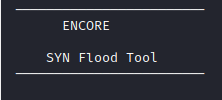
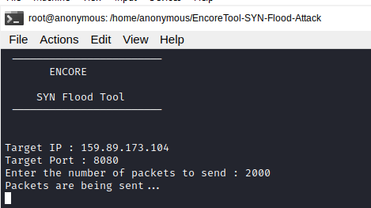

# ENCORE



## Dependencies
```
apt install python-scapy
apt install python3-scapy
```

## Installation

```
git clone https://github.com/Jibranwani/EncoreTool.git
cd Python-SYN-Flood-Attack-Tool
```


## Usage

```
python3 py_syn_cmd.py -t 159.89.173.104 -p 8080 -c 5
python3 py_synflood.py
```
```
usage: py3_synflood_cmd.py [-h] [--target TARGET] [--port PORT]
                           [--count COUNT] [--version]

optional arguments:
  -h, --help            show this help message and exit
  --target TARGET, -t TARGET
                        target IP address
  --port PORT, -p PORT  target port number
  --count COUNT, -c COUNT
                        number of packets
  --version, -v         show program's version number and exit

Usage: python3 py3_synflood_cmd.py -t 10.20.30.40 -p 8080 -c 1
```
